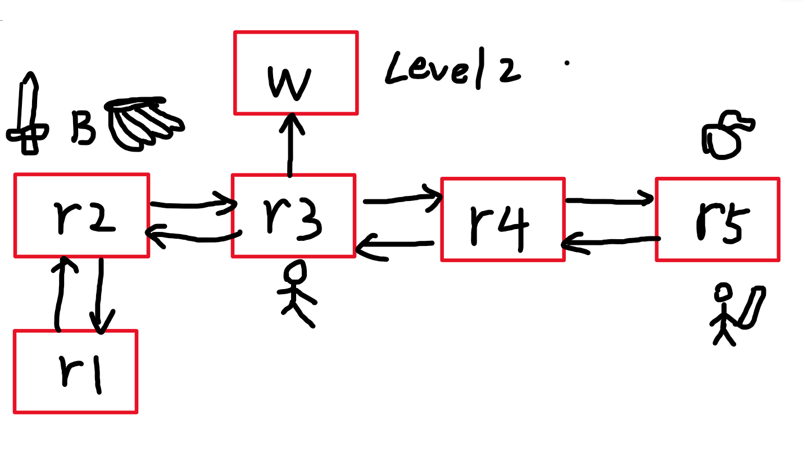

# 游戏名称：勇闯地下城

## 简介

一个文字版的类魔塔游戏，通过输入相应的指令进行操作。**由CLion2024.2.4编译器通过c++编写，运行即可游玩！**

**Introduction文件夹** 中可以查看每一关的地图


- 通过与电脑的交互完成关卡。
- 通过合理的分配来完成挑战。
- 击败强大的敌人来提高自己吧！

## 展示类结构

```bash
├── Enemy/                  # 敌人相关类
│   ├── Boss.h
│   ├── Clowns.h
│   └── EnemyObject.h       # 敌人基类
├── Introduction/           # 游戏介绍资源
│   ├── Lv1_Map.png         # 关卡地图
│   └── Map.png
├── Object/                 # 游戏物品相关类
│   ├── GameObject.h        # 物品基类
│   ├── Disposable/         # 消耗品
│   │   └── Food.h
│   └── Equipment/          # 装备
│       └── Weapon.h
├── CMakeLists.txt          # CMake 构建配置文件
├── main.cpp                # 程序入口
├── Room.cpp                # 房间逻辑实现
├── Room.h                  # 房间类定义
├── State.cpp               # 游戏状态逻辑实现
├── State.h                 # 游戏状态类定义
├── strings.h               # 字符串定义
├── wordwrap.cpp            # 文本换行工具实现
├── wordwrap.h              # 文本换行工具定义
```


## 操作指南

每次输入一个相应的命令后回车`Enter`进行下一步的操作

1. **基础操作**（处于房间中可以进行的操作）
   - **移动** ：向上移动`north` 或 `n`，向下移动`south` 或 `s`，向左移动`east` 或 `e`，向右移动`west` 或 `w`
   - **查看属性面板** ：查看主角属性`state` , 查看怪物属性`enemy`
   - **打开背包** ：`bag` 或 `b`
   - **拾取道具** ：`get` 或 `g`
   - **战斗** ：`fight` 或  `f`
   - **存档** ：`save`
   - **读档** ：`load`
   - **退出** ：`quit` 

2. **进阶操作**（处于背包中的操作）
   - **关闭背包** ：`close` 或 `b`
   - 选择一个背包中的道具或装备的道具
     - 选择装备的道具 **脱下装备** ：`takeoff`
     - 选择背包中的道具 **穿戴道具** ：`equip` ，**丢弃道具** ：`drop` ，**使用道具** `use`
